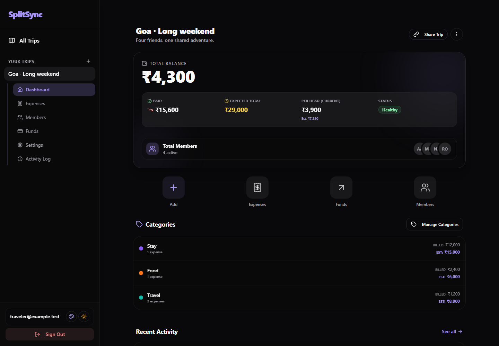
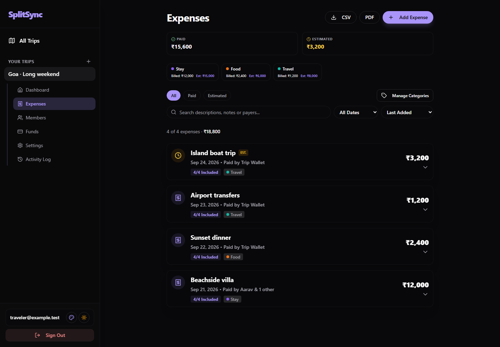
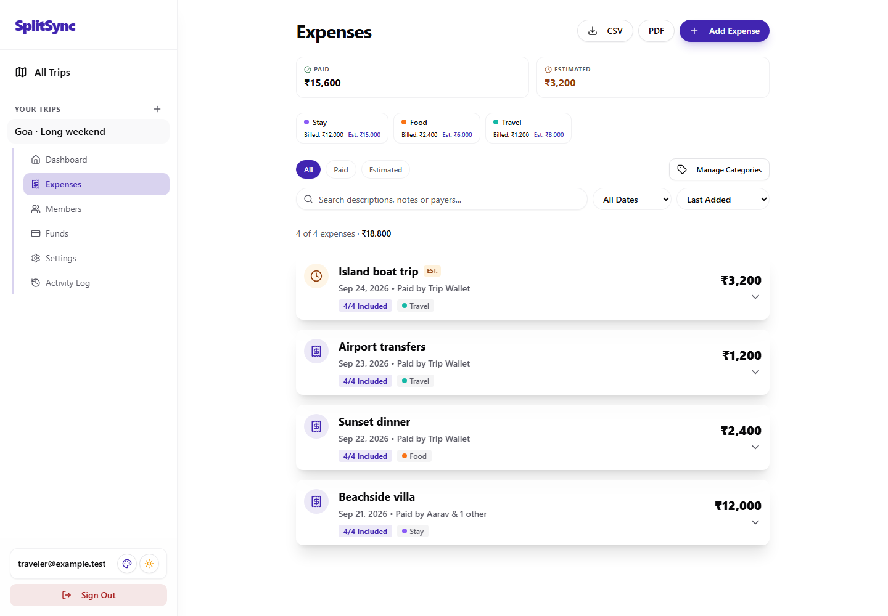
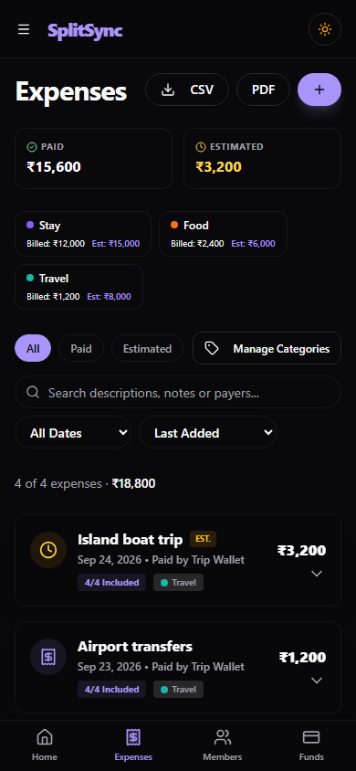
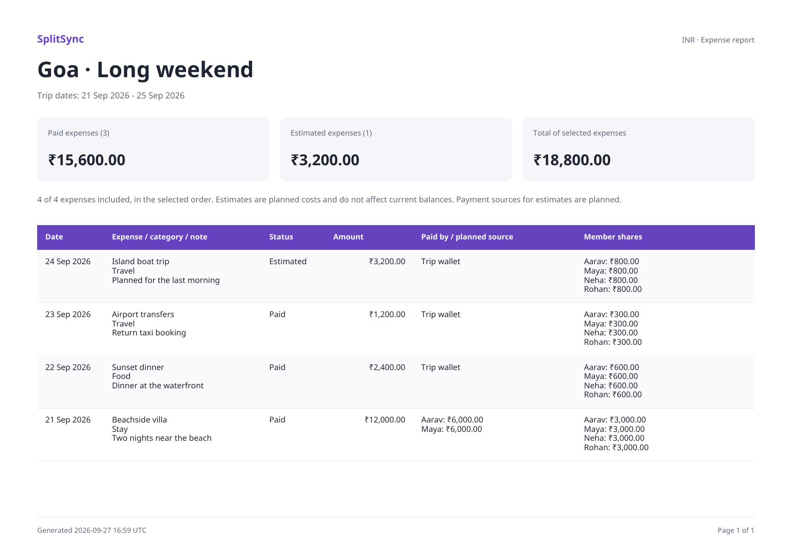

# SplitSync

**Keep trip spending clear, from the first shared bill to the final balance.**

SplitSync is a responsive trip expense tracker for groups. Record expenses, split costs, manage a shared wallet, and give everyone a clear view of what they paid and owe.



## Features

- **Trips and members:** multiple trips, member groups, co-admins and inactive members with preserved history.
- **Flexible expenses:** equal or custom shares, one or multiple payers, wallet payments, private receipt images (JPEG/PNG/WebP, up to 10 MB before compression), categories, and paid or estimated costs.
- **Accurate balances:** integer paise, deterministic remainder handling, separate actual and estimated spending, and wallet refunds.
- **Search and filters:** find descriptions, notes, payers or categories; filter by date/status; sort by date or amount; see the matching total.
- **Exports:** filtered CSV, printable PDF expense reports, all-member balances, individual member statements, and a JSON trip backup.
- **Sharing:** a read-only trip link with an optional PIN.
- **Everyday usability:** mobile layouts, dark/light themes, installable PWA, connection status, and an update prompt.
- **Safer changes:** validated split/payer totals, database access rules, conflicting-edit detection and protected member history.

## Screenshots

Captured from the running app with fictional data. Refresh them with `pnpm screenshots`.

### Expenses



### Light theme



### On your phone



## Run locally

You need Node.js **22.20 or later**, pnpm **12.3.4**, and a Supabase project with the repository's migrations applied.

```sh
corepack enable
pnpm install --frozen-lockfile
```

Copy `.env.example` to `.env` and enter your public Supabase configuration:

```dotenv
VITE_SUPABASE_URL=https://your-project-ref.supabase.co
VITE_SUPABASE_PUBLISHABLE_KEY=your-publishable-key
```

Enable email authentication and allow `http://localhost:5173/trips` as an Auth redirect URL. Google sign-in is optional and requires provider configuration in Supabase.

```sh
pnpm dev
```

Open [localhost:5173](http://localhost:5173). Follow the [database setup and deployment guide](docs/deployment.md) for migrations, authentication and hosting.

**Existing installations:** apply all three September 26–28 migrations before deploying this frontend. They harden expense writes, protect financial history, and make receipts private. See the [upgrade steps](docs/deployment.md#updating-an-existing-installation).

## Typical workflow

1. Sign in and create a trip.
2. Add members and optional categories/budgets.
3. Add funds if the group uses a shared wallet.
4. Record an expense, choose the payer(s), and select each member's share.
5. Review member balances, filter expenses, or export a report.
6. Enable sharing to let others view the trip. Download a backup from **Trip Settings**.

## Development commands

| Command | Purpose |
| --- | --- |
| `pnpm dev` | Start the development server |
| `pnpm typecheck` | Check all application TypeScript projects |
| `pnpm lint` | Run Oxlint |
| `pnpm test` | Run money, date, validation, balance and export regressions |
| `pnpm test:db` | Apply every migration and test access/integrity in embedded PostgreSQL |
| `pnpm test:e2e` | Run Chromium, Firefox and WebKit functional, accessibility and layout checks |
| `pnpm build` | Type-check and build production assets in `dist/` |
| `pnpm preview` | Preview the production build |
| `pnpm check` | Run lint, unit/database tests and the production build |
| `pnpm screenshots` | Regenerate the README screenshots |

Install the test browsers once before running browser tests or screenshots:

```sh
pnpm exec playwright install chromium firefox webkit
```

CI runs the checks and browser tests for pushes and pull requests. The automated tests do not modify your live Supabase project. Staging checks are still needed for real Auth, Storage and PostgREST configuration.

## PDF reports

- **Expenses → PDF:** exports the current search/filter selection and sort order. Landscape A4 pages include paid/estimated totals, categories, notes, every payer's contribution and every member's share.
- **Members → Export:** exports all members with direct payments, net wallet deposits, paid expense shares and the amount each member owes or gets back.
- **Member profile → Export PDF:** creates an individual statement, including expenses they paid for, their shares, wallet deposits and refunds.

Reports include exact two-decimal amounts, INR symbols, generation time in UTC, repeating table headers and page numbers. Estimates are clearly labeled and excluded from current balances. Export errors can be retried from the dialog. PDFs are generated in your browser; no external PDF service receives the trip data.

The PDF module loads on demand. Bundled [Noto Sans fonts](public/fonts/OFL.txt) support the rupee symbol, Latin, Greek and Cyrillic text; other scripts and emoji may need additional fonts. These fonts are distributed under the SIL Open Font License. Receipts are not embedded in PDF reports.



To recreate sample reports with fictional data, run `CAPTURE_PDFS=1 pnpm test:e2e --project=chromium` (PowerShell: `$env:CAPTURE_PDFS='1'; pnpm test:e2e --project=chromium`). They are saved in the ignored `output/pdf/` directory. If port 4173 is busy, set `PLAYWRIGHT_PORT` to an unused port.

## Stack and structure

React · TypeScript · Vite · Supabase · TanStack Query/Router · Tailwind CSS · Radix UI · Zod · Vitest · Playwright

```text
src/
  app/                 Routing and providers
  components/          Expense forms, layout and UI primitives
  features/            Supabase queries and mutations
  lib/                 Money, balances, dates, validation and exports
  pages/               Trip, expense, member, wallet and shared views
  tests/               Regression tests
supabase/migrations/   Versioned database schema and policies
e2e/                   Browser tests and fictional fixtures
scripts/               Database verification and screenshot capture
docs/                  Architecture, deployment and screenshots
```

## Scope and data handling

- Currency is currently **INR**. Values are stored as integer paise.
- The PWA caches the app shell. Loading and saving data requires internet access.
- JSON backup is an export format; automatic import/restore is not implemented. Receipt image files are not embedded.
- Receipts use a **private bucket** after the September 28 migration. Only the owner and admins can open them through links that expire after five minutes. Shared-trip visitors cannot view receipt images.
- Members with financial history can be disabled; individual deletion is blocked to preserve existing records.
- Earlier Git revisions contained credentials and local data. Read [Security](SECURITY.md) before publishing this repository.


## Documentation

[Release checklist](docs/release-checklist.md) · [UI audit](docs/ui-audit.md) · [Deployment and database setup](docs/deployment.md) · [Architecture](docs/architecture.md) · [Contributing](CONTRIBUTING.md) · [Security](SECURITY.md)
